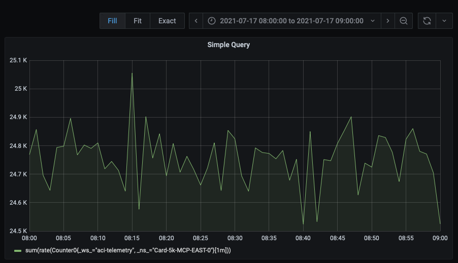
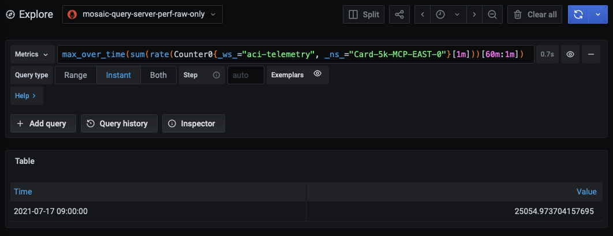

## Introducing Subquery in FiloDB

Subquery was introduced in Prometheus 2.7 and we started implementing the feature in FiloDB in 2020. The current integration branch is mostly feature complete though some of its functionality depends on the new ANTLR based parser. In this post I will describe:
* the feature itself
* motivation to implement subquery in FiloDB
* limitations of the approach.

---

### What is subquery
In its essence subquery allows to run a PromQL expression multiple times and generate a range vector with an output of each individual expression.
Imagine you have a simple query 
```
sum(rate(Counter0{_ws_="aci-telemetry", _ns_="Card-5k-MCP-EAST-0"}[1m]))
```
If you invoke such a query with a range query API given a particular start/end/step over grafana, you would see a graph showing a rate of Counter0. 


You can eyeball max min and can even approximate an average, however, if you want the exact number computed and presented to you, you would want to run a query like this one:
```
max_over_time(sum(rate(Counter0{_ws_="aci-telemetry", _ns_="Card-5k-MCP-EAST-0"}[1m])))
```
In Prometheus, you will get an error "expected type range vector in call to function "max_over_time". The expression above indeed does not make sense. What you want is to run the expression "sum(rate(Counter0{_ws_="aci-telemetry", _ns_="Card-5k-MCP-EAST-0"}[1m]))" N times, where N = end - start (start and end are expected to be minutes). The problem though is that normal range query API of Prometheus or FiloDB will run the top most expression multiple times, which is function "max_over_time". You, however, want to run "sum(rate(Counter0{_ws_="aci-telemetry", _ns_="Card-5k-MCP-EAST-0"}[1m]))" N times and feed the results back to max_over_time. 

The solution to the problem is the new syntax allowing you to explicitly mark expression that you want to run multiple times allowing to generate a range vector which you can consume later on with a range function. Hence, we would rewrite the previous broken query:
```
max_over_time(sum(rate(Counter0{_ws_="aci-telemetry", _ns_="Card-5k-MCP-EAST-0"}[1m]))[60m:1m])
```


Previously one could still solve the problem by using recording rules and essentially producing a new metric out of the expression that we want to repeat multiple times, something like:

```
record: nemspace:Counter0:sum_rate
sum(rate(Counter0{_ws_="aci-telemetry", _ns_="Card-5k-MCP-EAST-0"}[1m]))
```
Before being able to access the data one would have to wait for the recording rule to produce sufficient amount of data.

### Motivation
Queries similar to presented in the above section are useful for reporting, billing, and capacity planning. Query below shows a maximum cpu usage of a container over a 24 period of time. 
```
max_over_time(
   sum by (container) (
      rate(container_cpu_usage_seconds_total{_ws_="ws",_ns_="ns"}[1h])
   )[24h:1h]
)
```
Generally speaking, queries like the above, could probably be addressed with recording rules, however, writing proper recording rule is not easy if one has to wait a day before he can validate that it is correct. Subqueries allow to iterate on recording rules very quickly.

### Limitations
#### Performance
The most straitforward way to implemenet subquery is to run multiple simple queries exactly as many times are there are steps in the subquery lookback.

```
for (int i=start; i<end; i+=step) {
  result += run_query(subquery, i)
}
return result
```

For various reasons we do not do so and instead retrieve the whole time series in one swing and do the requested transformation on it later. One can come up with a query like this one:
'''
rate(foo[1m])[180d:30d]
'''
This would essentially force us to retrieve the entire 180 days of foo from the storage and later extract only 6 minutes out of it. We assume that such sampling queries, however, are not common.

#### Unimplemented
Currently, not all of the _over_time functions are implemented for subqueries. For example, quantile_over_time function for subqueries is not implemented yet.
